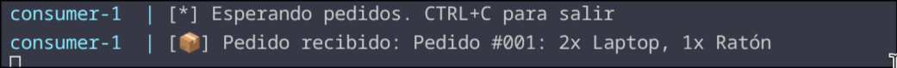
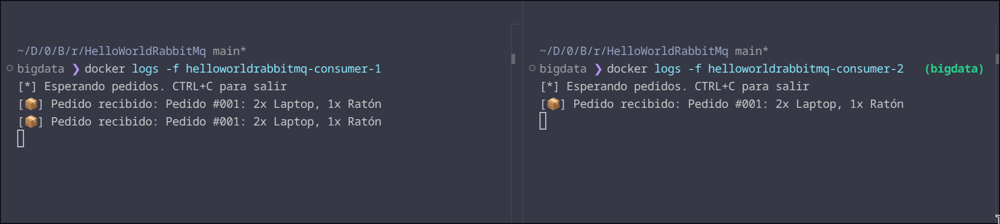
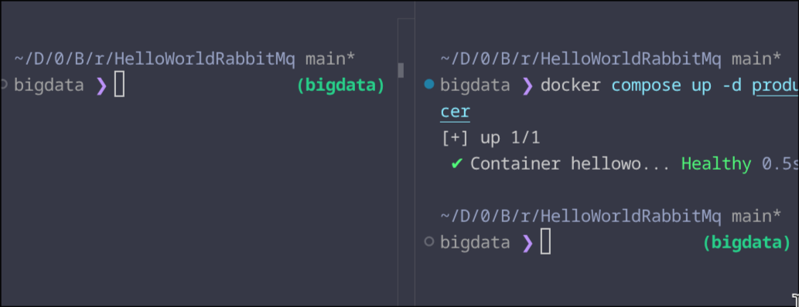
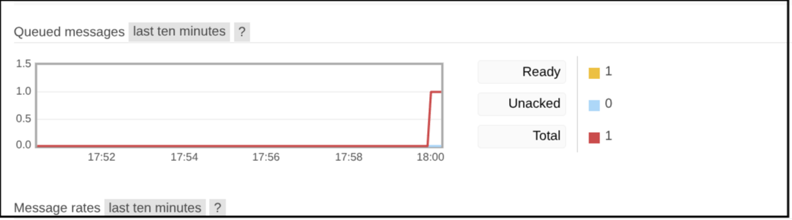
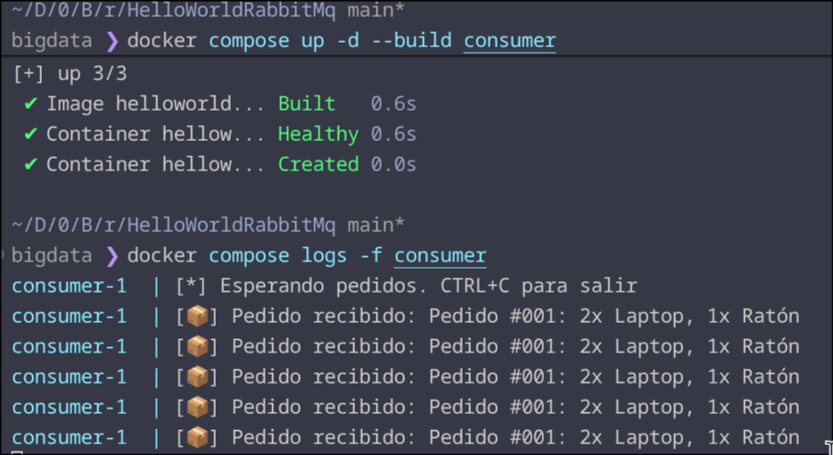

## Observaciones

Para poner a prueba el sistema, voy a ejecutarlo con el siguiente orden.

1. Iniciamos el contenedor de RabbitMQ, aquí es donde estará toda la gestión del servicio.
   ```shell
   docker compose up -d --build rabbitmq
   ```

2. Ahora voy a iniciar el consumidor, este es el encargado de recibir los mensajes que enviará el producer.
   ```shell
   docker compose up -d --build consumer
   ```
   - Para ver el contenido en tiempo real, lo veremos con este comando:
     ```shell
     docker compose logs -f consumer
     ```

3. Por último, necesitamos el producer, este es el encargado de enviar el mensaje a la cola, para que el consumer lo reciba, ya que escuchará en la misma cola.
   ```shell
   docker compose up -d --build producer 
   ```
Podemos ver que el consumidor ha recibido el pedido simulado en tiempo real.


Ahora voy a abrir otra terminal y ejecutar el siguiente comando para crear otro consumer.
```shell
docker compose up --scale consumer=2
```

Ahora vamos a volver a enviar el mensaje.
```shell
docker compose up -d producer 
```

Podemos ver en la imagen cómo el consumer 1 tiene dos mensajes (el anterior y el nuevo) y el consumer 2 (terminal de la derecha) tiene el pedido recibido.


Por último, vamos a probar a enviar un pedido sin el consumer escuchando en la cola.



Accedemos al dashboard de RabbitMQ, en el apartado de queues.


Podemos ver en el dashboard cómo el mensaje está en la cola, esperando a que un consumidor escuche ese mensaje.

## Preguntas de reflexión

### ¿Qué pasa si ejecutas el producer 5 veces antes de lanzar el consumer?

```shell
for i in (seq 5); docker compose up producer; end
```

Ahora levantamos el consumidor.
```shell
docker compose up -d --build consumer
```
Y vemos los logs
```shell
docker compose logs -f consumer
```

Podemos ver cómo ha obtenido esos 5 mensajes de la cola.



### ¿Por qué routing_key='pedidos' tiene que ser igual al nombre de la cola?
Tiene que ser el mismo nombre de la cola porque si no se pone ese mismo nombre, los consumidores nunca obtendrán el mensaje del productor.

### ¿Dónde dice "Default Exchange" en el código? ¿Qué indica exchange=''?
Este exchange envía el mensaje por la cola con el nombre del routing_key.

En el caso de indicar otro valor, como pedidos_exchange, el cliente se tendrá que conectar al pedidos_exchange, en la cola pedidos.

> Un exchange puede tener multiples colas.